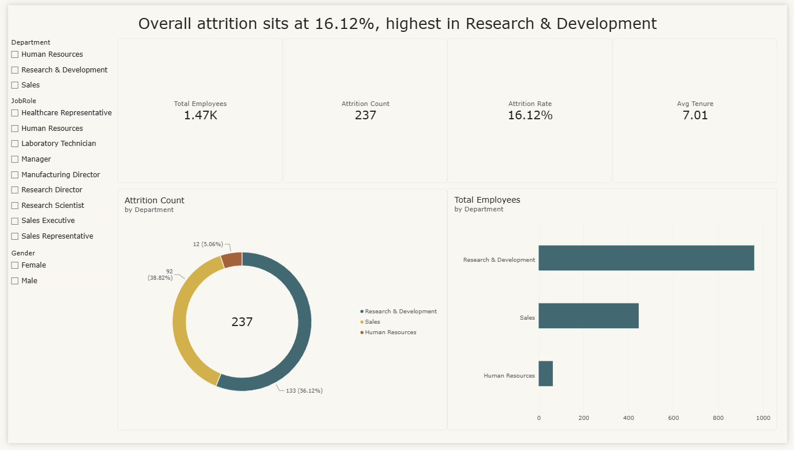
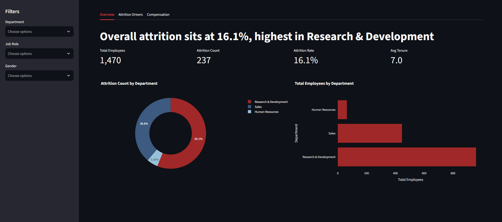
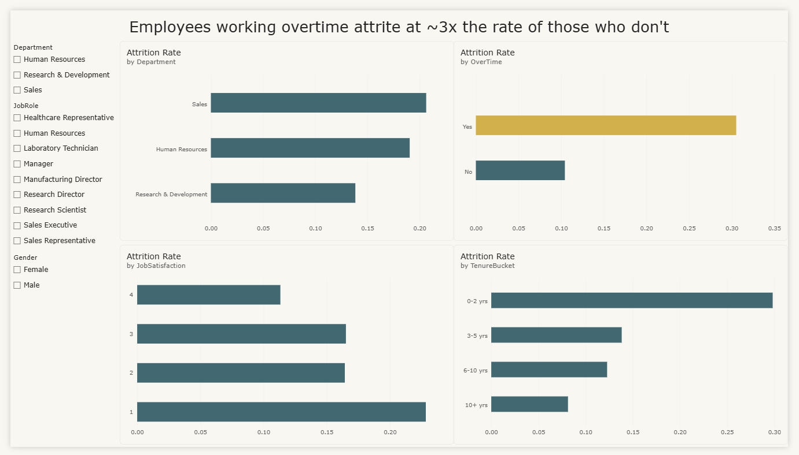
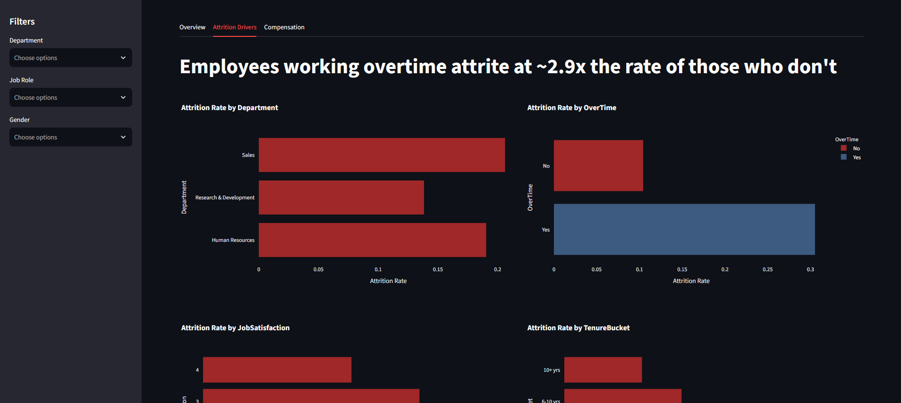
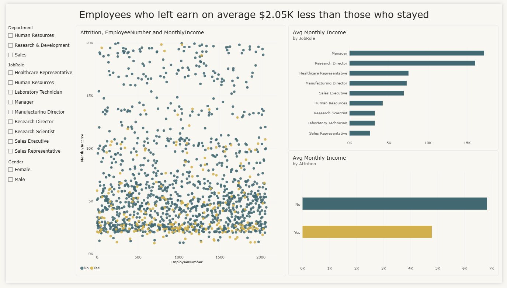
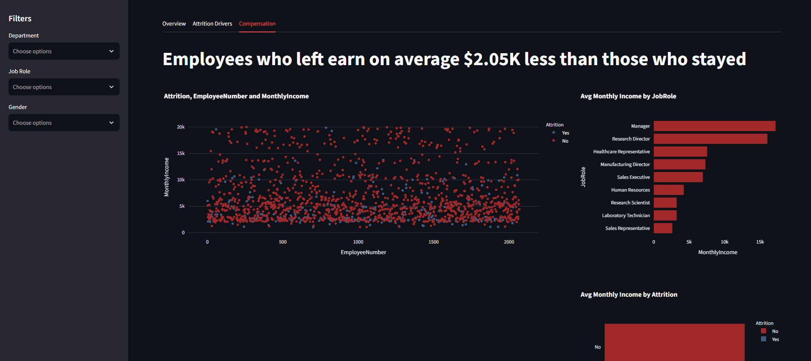

# HR Attrition Dashboard — IBM HR Analytics

A full BI deliverable built on the **IBM HR Analytics Employee Attrition** dataset — Power BI dashboard with DAX measures, plus a Streamlit web app version for easy sharing.

**[🚀 Live Streamlit Dashboard](https://ibm-hr-attrition-analytics-qffxfxk2pd3eddjvnurwuu.streamlit.app/)**

**[📈 Power BI Report (related csv and .pbix in Drive)](https://drive.google.com/drive/folders/1YYoQvQNMTR4hu9dmSWXSKSJRGHYMgFTe?usp=sharing)**

---

## Overview

This project analyzes employee attrition drivers — overtime, job satisfaction, tenure, department, and compensation — and presents them as an executive-ready, interactive dashboard. It was built two ways:

1. **Power BI** — the primary BI deliverable, with custom DAX measures and a 3-page report.
2. **Streamlit** — a lightweight web app mirroring the same pages/insights, for anyone without Power BI Desktop to explore live in a browser.

---

## Dataset

**[IBM HR Analytics Employee Attrition (Kaggle)](https://www.kaggle.com/datasets/pavansubhasht/ibm-hr-analytics-attrition-dataset)**
A fictional dataset created by IBM data scientists, containing 1,470 employee records with 35 attributes covering demographics, job role, compensation, satisfaction scores, and attrition status — used here to identify the key factors driving employee turnover.

---

## Key Insight

> Overall attrition sits at **16.12%**, driven heavily by **overtime work** (employees working overtime attrite at ~3x the rate of those who don't) and **low tenure** (0–2 years at the company is the highest-risk bracket). Employees who leave also earn **$2.05K less per month on average** than those who stay.

## Tech Stack

- **Python (pandas)** — data pre-cleaning
- **Power BI Desktop** — data modeling, DAX, primary dashboard
- **Streamlit + Plotly** — interactive web app version
- **Dataset:** IBM HR Analytics Employee Attrition (Kaggle)

## Project Structure

```
├── ibm_hr.csv                 # Raw dataset
├── data.ipynb                 # Python pre-cleaning notebook
├── HR_Attrition_Cleaned.csv   # Cleaned dataset (output of data.ipynb)
├── app.py                     # Streamlit dashboard
├── requirements.txt           # Python dependencies for the Streamlit app
├── powerbipage1.png           # Power BI screenshot — Overview
├── powerbipage2.png           # Power BI screenshot — Attrition Drivers
├── powerbipage3.png           # Power BI screenshot — Compensation
├── streamlitpage1.png         # Streamlit screenshot — Overview
├── streamlitpage2.png         # Streamlit screenshot — Attrition Drivers
├── streamlitpage3.png         # Streamlit screenshot — Compensation
├── .gitignore
└── HR_Attrition_Dashboard.pbix  # Power BI report (see Drive link above, not in repo)
```

## Data Cleaning

Light pre-cleaning was done in `data.ipynb` before loading into Power BI / Streamlit:
- Dropped constant/irrelevant columns (`EmployeeCount`, `StandardHours`, `Over18`)
- Handled nulls in `NumCompaniesWorked` and `TotalWorkingYears`
- Kept categorical fields as readable strings (`"Yes"/"No"`, department names, etc.) rather than encoding them, so both Power BI and Streamlit filters/axes stay human-readable
- Added a derived `TenureBucket` field (`0-2 yrs`, `3-5 yrs`, `6-10 yrs`, `10+ yrs`) for cleaner tenure-based charts

## DAX Measures (Power BI)

```dax
Attrition Rate =
DIVIDE(
    CALCULATE(COUNTROWS(Employees), Employees[Attrition] = "Yes"),
    COUNTROWS(Employees)
)

Total Employees = COUNTROWS(Employees)

Attrition Count =
CALCULATE(COUNTROWS(Employees), Employees[Attrition] = "Yes")

Avg Tenure = AVERAGE(Employees[YearsAtCompany])

Avg Monthly Income = AVERAGE(Employees[MonthlyIncome])

Attrition Rate by OT =
CALCULATE([Attrition Rate], Employees[OverTime] = "Yes")

High Satisfaction Attrition Rate =
CALCULATE([Attrition Rate], Employees[JobSatisfaction] >= 3)
```

## Dashboard Pages

Both the Power BI report and Streamlit app follow the same 3-page structure, with slicers for **Department**, **Job Role**, and **Gender** on every page.

### 1. Overview
KPI cards (Total Employees, Attrition Count, Attrition Rate, Avg Tenure) plus attrition and headcount breakdowns by department.

| Power BI | Streamlit |
|---|---|
|  |  |

### 2. Attrition Drivers
Attrition rate broken down by department, overtime status, job satisfaction, and tenure bucket.

| Power BI | Streamlit |
|---|---|
|  |  |

### 3. Compensation Analysis
Monthly income distribution by attrition status, plus average income by job role.

| Power BI | Streamlit |
|---|---|
|  |  |

## Running the Streamlit App Locally

```bash
pip install -r requirements.txt
streamlit run app.py
```

## Running the Power BI Report

1. Download the `.pbix` file from the [Drive link](https://drive.google.com/drive/folders/1YYoQvQNMTR4hu9dmSWXSKSJRGHYMgFTe?usp=sharing)
2. Open in Power BI Desktop
3. Refresh data if the source path has changed on your machine